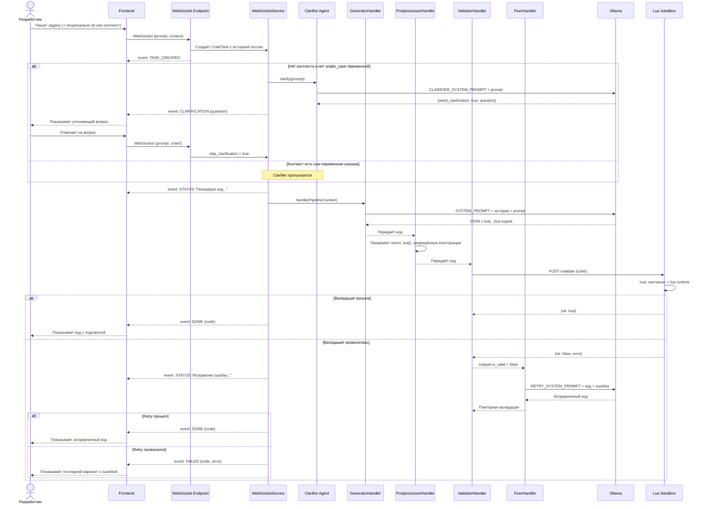

# МТС True Tech Hack 2026 — LocalScript

Агентская система генерации Lua-кода для LowCode платформы MWS Octapi на основе локальной LLM.

## Запуск

1. Склонируйте репозиторий

```bash
git clone https://git.truetecharena.ru/tta/true-tech-hack2026-localscript/asdasdasd/task-repo.git
cd task-repo
```

2. Создайте `.env` из шаблона

```bash
cp .env.example .env
```

Содержимое `.env`:

```
DEBUG=True
API_HOST=localhost
API_PORT=8000
FRONTEND_PORT=3000
SANDBOX_PORT=8081
OLLAMA_URL=http://localhost:11434
OLLAMA_MODEL=qwen2.5-coder:7b-instruct-q4_K_M
VALIDATOR_URL=http://localhost:8081/validate
MAX_RETRIES=2
```

3. Запустите приложение

```bash
docker compose up -d --build
```

После запуска:
- Веб-интерфейс: `http://localhost:3000`
- REST API: `http://localhost:8000/generate`
- Swagger: `http://localhost:8000/docs`

## Демонстрация

Генерация кода через REST API:

```bash
curl -X POST http://localhost:8000/generate \
  -H "Content-Type: application/json" \
  -d '{"prompt": "Получи последний email из списка"}'
```

Ответ:

```json
{"code": "{\"lastEmail\": \"lua{return wf.vars.emails[#wf.vars.emails]}lua\"}"}
```

Веб-интерфейс поддерживает передачу контекста `wf.vars`:

```json
{"wf": {"vars": {"emails": ["a@b.com", "c@d.com"]}}}
```

## Docker контейнеры

| Контейнер | Описание |
|---|---|
| `frontend` | nginx отдающий статический HTML+JS чат |
| `backend` | FastAPI бэкенд с агентским pipeline |
| `lua-sandbox` | Изолированная среда валидации Lua-кода через luac |
| `ollama` | Локальный LLM сервер |
| `ollama-pull-init` | Init контейнер — скачивает модель при первом запуске |

## Структура проекта

```
task-repo/
├── backend/
│   ├── app/
│   │   ├── api/
│   │   ├── core/
│   │   └── services/
│   │       ├── ollama/
│   │       ├── tasks/
│   │       └── websocket/
│   └── lua-sandbox/
├── frontend/
├── docker-compose.yml
└── .env.example
```

## Выбранные технологии

- **Python 3.12** + **FastAPI** + **uvicorn** — бэкенд
- **Pydantic** — валидация схем и structured outputs
- **uv** — менеджер зависимостей
- **Ollama** — локальный LLM сервер
- **qwen2.5-coder:7b-instruct-q4_K_M** — языковая модель

**Почему qwen2.5-coder:** модель специализирована на генерации кода, не имеет thinking mode (токены не тратятся на размышления), стабильно следует инструкциям structured outputs, влезает в 8GB VRAM в квантизованном варианте `q4_K_M`.

## Реализованные фичи

### Агентность
- **Clarifier** — система задаёт уточняющий вопрос если запрос неясный и не содержит имён переменных
- **Контекст диалога** — агент помнит историю разговора в рамках сессии и учитывает предыдущие запросы
- **Retry с валидацией** — при ошибке валидации fixer автоматически исправляет код через отдельный LLM вызов

### Качество генерации
- **Structured outputs** — JSON Schema в запросе к Ollama гарантирует валидный формат ответа
- **Few-shot prompting** — 7 примеров из публичной выборки платформы в system prompt
- **Постобработка** — проверка наличия `return`, `lua{...}lua` обёртки и запрещённых конструкций до валидатора
- **Chain of Responsibility** — GeneratorHandler → PostprocessorHandler → ValidatorHandler → FixerHandler

### Инфраструктура
- **Lua Sandbox** — изолированный контейнер с синтаксической и runtime валидацией через `luac` и `lua`
- **WebSocket** — живые статусы генерации в реальном времени (processing, validating, done)
- **REST API** — синхронный `/generate` endpoint для жюри и интеграций
- **Swagger** — автоматическая документация на `/docs`

## Архитектура (C4)

```mermaid
C4Component
    title LocalScript — Full Architecture

    Person(user, "Разработчик", "Пишет задачи на естественном языке")
    Person(jury, "Жюри", "Тестирует через REST API")

    System_Boundary(localscript, "LocalScript") {

        Container_Boundary(frontend_c, "Frontend") {
            Component(frontend, "Chat UI", "nginx / index.html", "Статический HTML+JS чат с подсветкой Lua кода и полем wf.vars")
        }

        Container_Boundary(backend_c, "Backend (FastAPI)") {
            Component(ws_endpoint, "WebSocket /ws", "FastAPI WebSocket", "Управляет сессией, историей диалога и clarifier флагом")
            Component(rest_endpoint, "POST /generate", "FastAPI REST", "Синхронная генерация кода без истории диалога")
            Component(ws_service, "WebSocketService", "Python class", "Orchestrator: clarifier, pipeline, retry, история")
            Component(clarifier, "Clarifier Agent", "LLM вызов", "Задаёт уточняющий вопрос если запрос неясный")
            Component(generator, "GeneratorHandler", "Chain handler", "Генерирует Lua-код с few-shot промптом и structured outputs")
            Component(postprocessor, "PostprocessorHandler", "Chain handler", "Проверяет return, lua{}, запрещённые конструкции")
            Component(validator_h, "ValidatorHandler", "Chain handler", "Отправляет код на валидацию в Lua Sandbox")
            Component(fixer, "FixerHandler", "Chain handler", "Исправляет код после неудачной валидации")
        }

        Container_Boundary(sandbox_c, "Lua Sandbox") {
            Component(sandbox, "Validator", "Python FastAPI + luac", "Синтаксическая и runtime валидация Lua-кода")
        }

        Container_Boundary(ollama_c, "Ollama") {
            Component(llm, "qwen2.5-coder", "LLM / HTTP API", "Локальная языковая модель без внешних зависимостей")
        }
    }

    Rel(user, frontend, "Пишет задачу в браузере", "HTTPS")
    Rel(jury, rest_endpoint, "POST /generate", "HTTP")
    Rel(frontend, ws_endpoint, "Задачи и ответы на clarifier", "WebSocket ws://")
    Rel(ws_endpoint, ws_service, "Делегирует обработку", "")
    Rel(ws_service, clarifier, "Если нет контекста и нет snake_case переменной", "")
    Rel(ws_service, generator, "Запускает агентский pipeline", "")
    Rel(rest_endpoint, generator, "Запускает pipeline напрямую", "")
    Rel(generator, postprocessor, "Передаёт сгенерированный код", "chain")
    Rel(postprocessor, validator_h, "Передаёт проверенный код", "chain")
    Rel(validator_h, fixer, "При ошибке валидации", "chain")
    Rel(generator, llm, "Генерация Lua-кода", "HTTP /api/chat")
    Rel(clarifier, llm, "Проверка нужно ли уточнение", "HTTP /api/chat")
    Rel(fixer, llm, "Исправление кода", "HTTP /api/chat")
    Rel(validator_h, sandbox, "Валидация Lua-кода", "HTTP /validate")

    UpdateLayoutConfig($c4ShapeInRow="4", $c4BoundaryInRow="1")
```



## Sequence диаграмма



## Команда

| Участник | Роль |
|---|---|
| Максим Клюка | TechLead, Backend |
| Рафаэль Агишев | Backend |
| Мансур Карагулов | Frontend |
| Семён Глинских | DevOps |
| Максим Максимов | TeamLead, MLOps, ML |