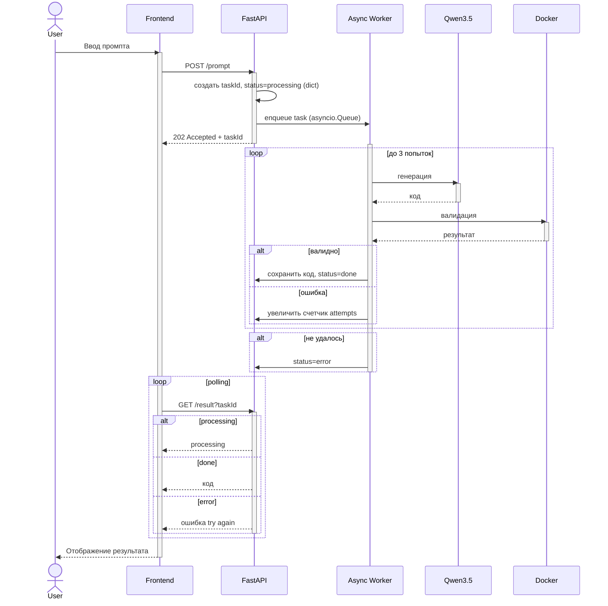

# local-script-mts
МТС True Tech Hack 2026 LocalScript

```mermaid
sequenceDiagram
    actor User
    participant Frontend
    participant API as FastAPI
    participant Worker as Async Worker
    participant Qwen3.5
    participant Docker

    User->>Frontend: Ввод промпта
    activate Frontend

    Frontend->>API: POST /prompt
    activate API

    API->>API: создать taskId, status=processing (dict)
    API->>Worker: enqueue task (asyncio.Queue)
    API-->>Frontend: 202 Accepted + taskId

    deactivate API

    activate Worker
    loop до 3 попыток
        Worker->>Qwen3.5: генерация
        activate Qwen3.5
        Qwen3.5-->>Worker: код
        deactivate Qwen3.5

        Worker->>Docker: валидация
        activate Docker
        Docker-->>Worker: результат
        deactivate Docker

        alt валидно
            Worker->>API: сохранить код, status=done
        else ошибка
            Worker->>API: увеличить счетчик attempts
        end
    end

    alt не удалось
        Worker->>API: status=error
    end
    deactivate Worker

    loop polling
        Frontend->>API: GET /result?taskId
        activate API

        alt processing
            API-->>Frontend: processing
        else done
            API-->>Frontend: код
        else error
            API-->>Frontend: ошибка try again
        end

        deactivate API
    end

    Frontend-->>User: Отображение результата
    deactivate Frontend
```
